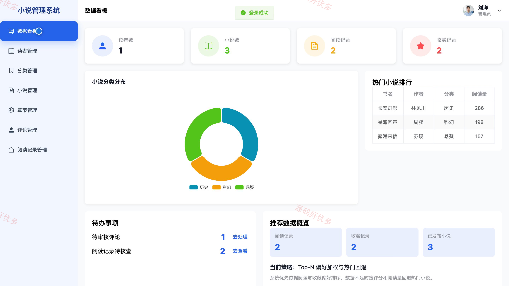
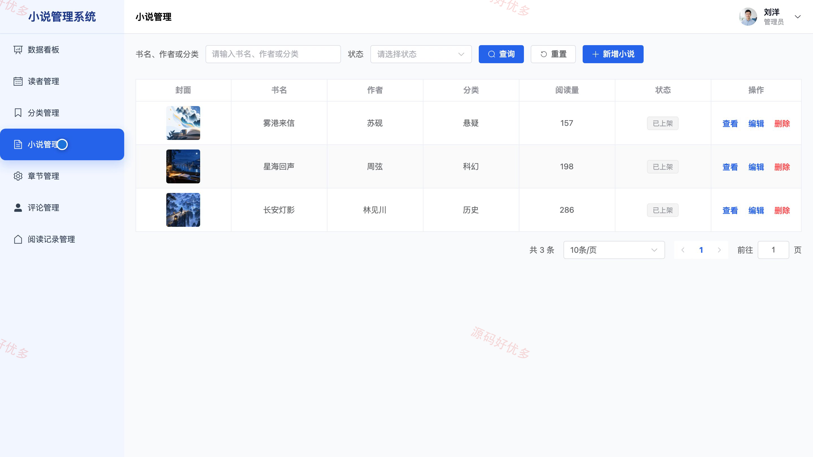
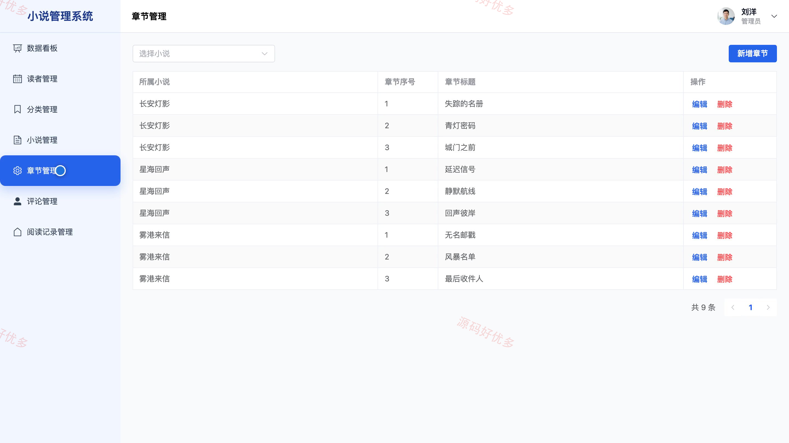

## 源码问题查看主页咨询

### 一、关键词
小说阅读、在线阅读、数字阅读、个性化书单、网络文学

### 二、作品包含
源码+数据库+万字设计文档+PPT+全套环境和工具资源+本地部署教程

### 三、项目技术
前端技术： Html、Css、Js、Vue3.4、Element-Plus
后端技术：Java、SpringBoot3.2.0、MyBatis-Plus

### 四、运行环境要求
开发工具：IDEA/eclipse + VSCODE

数据库：MySQL5.7+（共8张表）

数据库管理工具：Navicat10以上版本

环境配置软件： JDK17 + Maven3.6

前端Nodejs：16+

浏览器：谷歌浏览器

### 五、项目介绍
项目编号：bs115A

系统面向读者与管理员，为读者提供小说检索、详情查看、分章阅读、进度续读、书架收藏、评分评论、阅读历史和个性化推荐；管理员负责读者、小说分类、作品章节、评论及阅读数据的统一维护与统计。

角色：读者、管理员

读者功能：用户注册与登录、小说检索与详情查看、分章阅读与进度续读、个人书架收藏、小说评分与评论、阅读历史管理、个性化推荐、个人资料与密码维护。

管理员功能：读者账号管理、小说分类管理、小说资料与上下架管理、章节内容与排序管理、评论审核与回复管理、阅读记录与进度管理、推荐行为数据管理、小说与阅读数据统计。

### 六、运行截图

